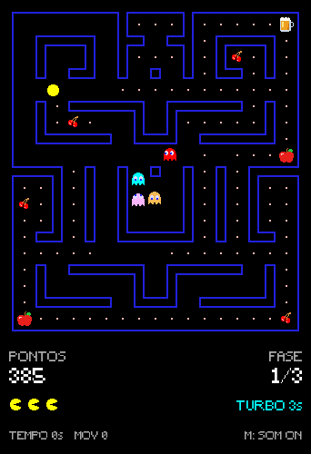
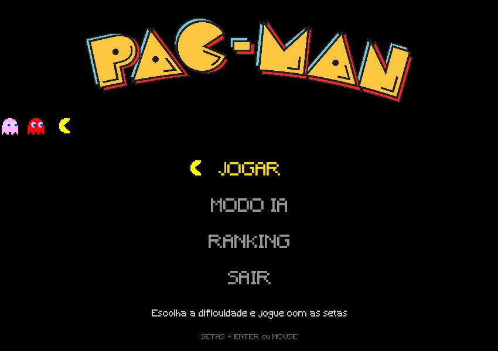

# 🟡 Pac-Man em C++ com SFML

Recriação do clássico Pac-Man em **C++17** com **SFML 2.6.2**, desenvolvida na disciplina de Algoritmos II para praticar Programação Orientada a Objetos.

 

## Funcionalidades

- **3 fases** com mapas diferentes
- **4 fantasmas**, cada um com o seu jeito de perseguir:
  | Fantasma | Alvo |
  |---|---|
  | Blinky | Vai direto no Pac-Man |
  | Pinky | Mira 4 blocos à frente do Pac-Man |
  | Inky | Usa a posição do Blinky para cercar o Pac-Man |
  | Clyde | Persegue de longe, mas recua quando chega perto |

  Os fantasmas alternam entre andar sem rumo (7 s) e perseguir (20 s), seguindo o menor caminho pelo labirinto, e são animados conforme a direção em que andam.
- **Pílulas fortalecedoras** (piscando no labirinto): por 5 s os fantasmas ficam azuis e podem ser comidos, piscando em branco quando o efeito está acabando. Um fantasma comido vira um par de olhos que volta para a casa e espera 5 s para sair
- **Itens especiais:**
  | Item | Efeito |
  |---|---|
  | Cereja | +100 pontos |
  | Maçã | +1 vida (até o número inicial de vidas) |
  | Energético | Velocidade ×2,5 por 5 s |
  | Cerveja | Perde metade dos pontos, mas fica 2× mais rápido por 5 s |
- **4 dificuldades:**
  | Dificuldade | Velocidade dos fantasmas | Vidas |
  |---|---|---|
  | Fácil | 2,0 blocos/s | 5 |
  | Médio | 2,4 blocos/s | 3 |
  | Difícil | 2,8 blocos/s | 2 |
  | Desafio | 2,8 blocos/s, com a tela escura e só um círculo de luz ao redor do Pac-Man | 1 |

  O Pac-Man anda sempre a cerca de 3,3 blocos/s.
- **Modo IA:** o Pac-Man joga sozinho, buscando a pílula mais próxima e desviando dos fantasmas
- **Ranking** salvo em arquivo, com nome, pontuação e data de cada partida; o nome é digitado na própria janela ao fim da partida
- **Visual e som no estilo arcade:** labirinto com contorno azul, Pac-Man virando para a direção do movimento, animação de morte, avisos de "PRONTO!" e fase concluída, vidas em ícones e efeitos sonoros (tecla **M** liga e desliga o som)

### Pontuação

| Ação | Pontos |
|---|---|
| Pílula | +10 |
| Pílula fortalecedora | +50 |
| Comer um fantasma | +200 |
| Cereja | +100 |
| Cada tecla de movimento | −2 |

Médio, Difícil e Desafio começam com um bônus de 15, 30 e 50 pontos.

## Controles

| Tecla | Ação |
|---|---|
| ← ↑ → ↓ | Mover o Pac-Man |
| M | Ligar e desligar o som |
| Mouse ou ↑ ↓ + Enter | Escolher as opções dos menus |
| Esc | Voltar ao menu (telas de dificuldade e ranking) |
| ↑ ↓ ou roda do mouse (no ranking) | Rolar a lista |
| Enter / Esc (fim de partida) | Salvar o nome no ranking / sair sem salvar |

## Requisitos

- Compilador com suporte a **C++17**. Testado com o GCC do [MSYS2](https://www.msys2.org/) (UCRT64) no Windows.
- **CMake 3.16+**
- **VS Code** com as extensões [C/C++](https://marketplace.visualstudio.com/items?itemName=ms-vscode.cpptools) e [CMake Tools](https://marketplace.visualstudio.com/items?itemName=ms-vscode.cmake-tools)

O SFML **não precisa ser instalado**: o CMake baixa e compila a versão 2.6.2 automaticamente.

No Windows, com o MSYS2 instalado, o compilador, o CMake e o Ninja são instalados pelo terminal **MSYS2 UCRT64** (o gerenciador de pacotes do MSYS2 também se chama `pacman`):

```bash
pacman -S mingw-w64-ucrt-x86_64-gcc mingw-w64-ucrt-x86_64-cmake mingw-w64-ucrt-x86_64-ninja mingw-w64-ucrt-x86_64-gdb
```

No Linux, instale antes as dependências de sistema do SFML:

```bash
sudo apt install libx11-dev libxrandr-dev libxcursor-dev libxi-dev libudev-dev libgl1-mesa-dev libfreetype-dev libopenal-dev libflac-dev libvorbis-dev
```

## Como compilar e executar

### Pelo VS Code
1. Abra a pasta do projeto no VS Code.
2. Quando o CMake Tools pedir, escolha um kit (compilador). No MSYS2, é o **GCC … ucrt64**.
3. Use **Build** e **▶ Run** na barra de status do CMake Tools, ou **F5** para depurar.

A primeira compilação demora cerca de 1 minuto, porque compila o SFML junto.

### Pelo terminal
```bash
cmake -B build
```
```bash
cmake --build build
```

O executável é gerado em `build/bin/`, junto com uma cópia da pasta `assets/` e, no Windows, o `openal32.dll` (usado pelo áudio do SFML; ele precisa ficar ao lado do `.exe`). O jogo procura os assets na pasta do próprio executável, então pode ser aberto de qualquer lugar:

```bash
./build/bin/pacman
```

No Windows, também dá para abrir com dois cliques em `build\bin\pacman.exe`.

O ranking é salvo em `build/bin/ranking.txt`.

## Estrutura do projeto

```
assets/             Imagens, fontes e sons
src/
  main.cpp          Loop do menu: Jogar, IA, Ranking e Sair
  Config.h          Constantes (tamanhos, velocidades, caminhos)
  Tipos.h/.cpp      Enums (Direcao, Celula...), Mapa e Posicao
  Mapas.h/.cpp      Os mapas das 3 fases
  Jogo.h/.cpp       Uma partida: etapas, colisões, itens, HUD e mensagens
  Labirinto.h/.cpp  Desenho das paredes no estilo arcade
  Pacman.h/.cpp     Pac-Man: animação, efeitos e modo IA
  Fantasma.h/.cpp   Classe base Fantasma + Blinky, Pinky, Inky e Clyde (com animações)
  Ranking.h/.cpp    Salvar, carregar e exibir o ranking
  Telas.h/.cpp      Menu e escolha de dificuldade
  Recursos.h/.cpp   Carregamento de texturas
  Sons.h/.cpp       Efeitos sonoros e mudo
CMakeLists.txt      Build (baixa o SFML 2.6.2 automaticamente)
```

Os mapas são grades de números em `src/Mapas.cpp`. O significado de cada número está no `enum Celula`, em `src/Tipos.h`.

## Autor

**Gustavo Corrêa de Mello**, Itajaí, SC
- 📧 gustavocmello27@gmail.com
- 💼 [LinkedIn](https://www.linkedin.com/in/gustavo-correa-de-mello-772a8834a)
- 🐙 [GitHub](https://github.com/mello745)

## Licença

Projeto desenvolvido para fins educacionais, como parte da disciplina Algoritmos II. Você pode estudar, modificar e aprimorar o código, desde que mantenha os créditos.

*Pac-Man é uma marca registrada da Bandai Namco Entertainment. Este é um projeto acadêmico, sem fins comerciais.*
